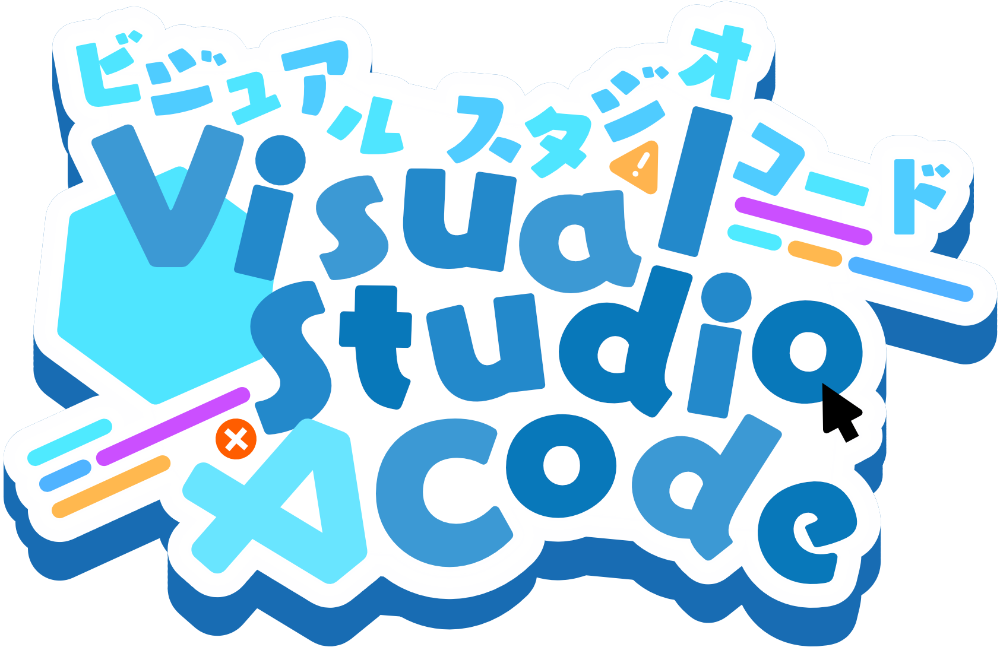

# ZeroCat 编程社区

高中喵开发，求Star支持

ZeroCat 是一个轻量级的在线编程、分享平台

## 背景

`ZeroCat` 最开始由 [@sunwuyuan](https://github.com/sunwuyuan) 在很早以前提出，我们希望搭建一个全开源的编程社区，这个项目也就从此开始了。但实际上项目在孙悟元初二的时候才有了很大进展。
 维护一个编程社区从某种程度上来说相当不易，但我相信，这个项目会一直开发下去。

这个项目的目标是：
 开发一个完整的支持 Scratch、Python 与其他适合编程初学者的编成社区

## 交流
QQ：964979747

## 示例

想了解社区效果，请参考 [ZeroCat](https://zerocat.houlangs.com)。

## 开发者

[@SunWuyuan](https://github.com/sunwuyuan)

| NodeJS      | Visual Studio Code | Cloudflare |
| :-------- | :--- | :--- |
|  |   |  |
